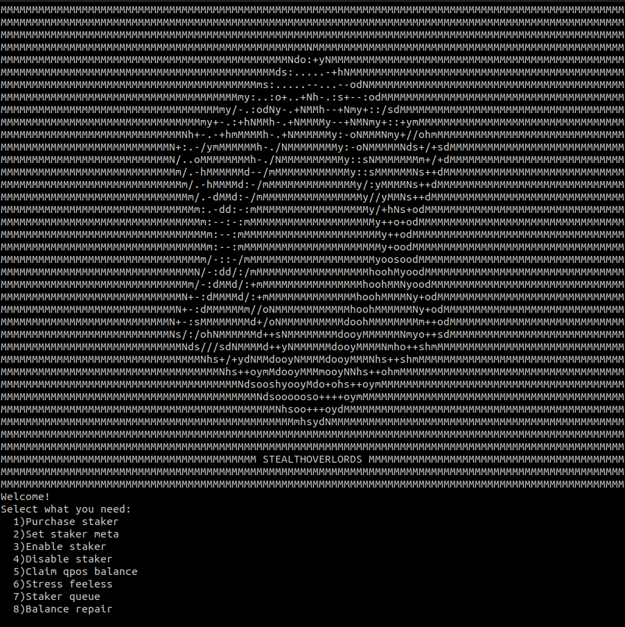

Ubuntu 22.04

Howto:
- git clone https://github.com/mahusar/stealth-daemon-tool.git
- cd stealth-daemon-tool
- cp stealth-daemon-tool.sh ~/.StealthCoin/
- cd ~/.StealthCoin
- chmod +x stealth-daemon-tool.sh
- apt-get install jq
- pwd (/yourpath)
- nano stealth-daemon-tool.sh
- /usr/local/bin/StealthCoind -conf=/home/yourpath/.StealthCoin/StealthCoin.conf"
- ./stealth-daemon-tool.sh

 Donation XST address: S6BMAeJhxuf8CZXBBVZxmr4YFhhg9AZ1dz  

